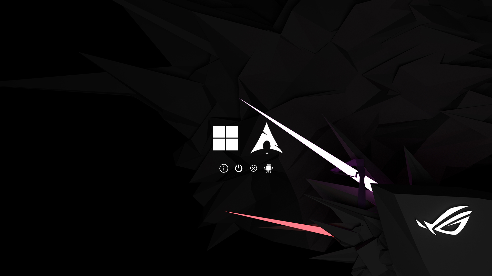

# Minimalistic ROG rEFInd Theme

[rEFInd](http://www.rodsbooks.com/refind/) is a user-friendly boot manager for UEFI-based systems. This repository provides a clean, minimal theme inspired by ROG aesthetics.



---

## Features

- Minimal and modern design
- Custom icons for popular operating systems
- ROG-inspired background
- Easy installation and configuration

---

## Installation

1. **Find your rEFInd EFI directory**
   Commonly located at `/boot/EFI/refind`. Use `fdisk -l` and `mount` to locate your EFI System Partition (ESP) if needed.

2. **Create a `themes` folder**
   Inside your rEFInd directory, create a folder named `themes` if it doesn't exist.

3. **Clone this repository**
   Clone into the `themes` directory:

   ```sh
   git clone https://github.com/yourusername/rEFInd-minimal-rog.git themes/rEFInd-minimal-rog
   ```

4. **Enable the theme**
   Add the following line to the end of your `refind.conf`:
   ```
   include themes/rEFInd-minimal-rog/theme.conf
   ```

---

## Example Menu Entries

Below are sample entries for Linux, Windows, and macOS. Icons are specified for each OS.

```nginx
menuentry "Arch Linux" {
    icon /EFI/refind/themes/rEFInd-minimal-rog/icons/os_arch.png
    loader vmlinuz-linux
    initrd initramfs-linux.img
    options "rw root=UUID=dfb2919d-ff78-48db-a8a7-23f7542c343a loglevel=3"
}

menuentry "Windows" {
    icon /EFI/refind/themes/rEFInd-minimal-rog/icons/os_win.png
    loader /EFI/Microsoft/Boot/bootmgfw.efi
}

menuentry "macOS" {
    icon /EFI/refind/themes/rEFInd-minimal-rog/icons/os_mac.png
    loader /EFI/Apple/Boot/bootmgfw.efi
}
```

Autodetected entries will also display the correct icons.

---

## Customization

### Background

If the included wallpaper appears blurry, it may not match your monitor's resolution. Download the [original high-quality wallpaper][wallpaper], resize it as needed, and replace `background.png`. You can also use any background of your choice.

### Icons

All icons are 320x320px PNGs. If you need additional OS icons, feel free to [open an issue](https://github.com/Paradox-AT/rEFInd-minimal-rog/issues) or submit a pull request.

---

## Attribution

Background: [ROG Wallpaper Challenge - 37][wallpaper] from the ROG Wallpaper Challenge 2017.

[wallpaper]: https://rog.asus.com/wallpapers/yourcreation/
